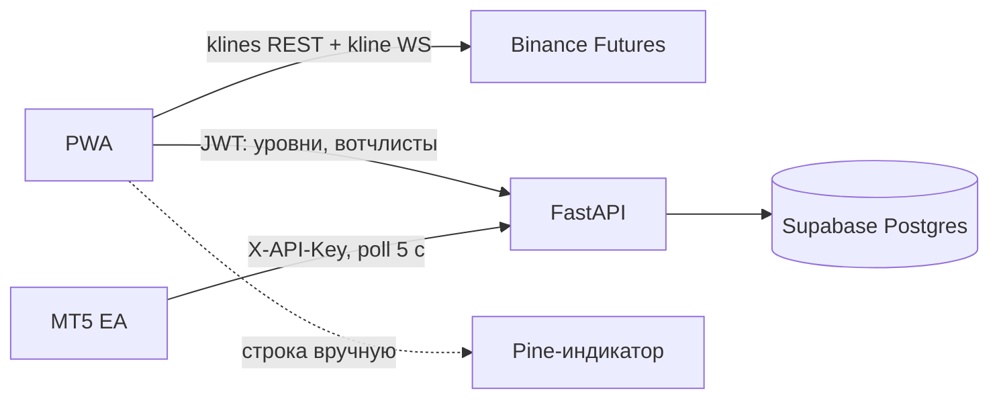

# ChartSwipe — архитектура

> Источник истины для всей логики. Код обязан соответствовать этому документу; при расхождении сначала правится документ.
> Основа: спецификация от 26.09.2026 (@Stan). Решения по открытым вопросам — в разделе «Решения (ADR)».

## 1. Рамки MVP

| Входит | Не входит (v1+) |
|---|---|
| Лента (F1), график (F2), 3 ТФ (F3), уровни с магнитом (F4) | Push-алерты (F8), шаринг (F9; скриншот графика — уже в MVP, A19) |
| Синк уровней: Supabase + FastAPI, MT5 EA, Pine-строка (F5) | Chrome-расширение, маппинг тикеров в UI |
| Вотчлисты с импортом (F6) | Форекс/индексы, мульти-биржа (Bybit/OKX) |
| Ложные пробои дневных уровней, клиентский TS-детектор (F7) | Серверный Python-детектор, «ЛП сегодня» для пушей |
| Один пользователь (сам автор) | Тарифы Free/Pro, онбординг, лендинг |

Рынок: **только крипта, Binance USDⓈ-M Futures** (перпы).

## 2. Решения (ADR)

| # | Решение | Почему |
|---|---|---|
| A1 | TradingView в MVP — только Pine-строка | Нет публичного API; расширение хрупкое, уходит в v1 |
| A2 | Источник свечей — Binance Futures (`fapi`/`fstream`) | Ближе к CFD пропа (BTCUSD), больше ликвидности |
| A3 | MVP для себя, без монетизации | Меньше кода; тарифы заложим в v1 |
| A4 | Источники ленты (top50, движение дня, ЛП сегодня) в MVP считаются **на клиенте** из публичного API Binance; `GET /v1/feed` — в v1 | Сервер не ходит на биржу в MVP, меньше инфраструктуры |
| A5 | Сервер хранит только пользователей, уровни, вотчлисты, маппинг, ключи. Свечи — никогда | Лимиты бирж расходуются с IP клиента |
| A6 | Синк EA по курсору `updated_at` сервера, а не часам клиента | Нет рассинхрона часов VPS/телефона |
| A7 | Цвет в CSV для EA отдаётся в **BGR** (формат `color` в MQL5) | В MQL5 `color` = `0x00BBGGRR`; RGB дал бы неверные цвета |
| A8 | Рабочее название — ChartSwipe | Не блокирует разработку |
| A9 | **Только веб-сайт.** Открыл адрес в мобильном браузере — сразу лента и свайп. Никаких установок, баннеров «добавить на экран», сторов, Capacitor (убран и из v2) | Требование пользователя (26.09.2026). Service worker остаётся только как невидимый кэш для скорости |
| A10 | **Без стены логина.** `/` сразу открывает ленту; уровни, избранное, вотчлисты живут локально (IndexedDB). Вход (magic link) нужен только для синка в MT5/TV — при входе локальные данные выгружаются на сервер | Ноль шагов до первого свайпа |
| A12 | Деплой на srv2 за существующим Caddy, без Dokploy; адрес на sslip.io | На сервере Caddy уже занимает 80/443; бесплатный LE-сертификат без покупки домена |
| A11 | Вертикальная лента — **собственный 3-слайдовый пейджер** на CSS `transform` (`web/components/FeedPager.vue`) вместо Swiper; все решения принимает `useGestures` (§5.3). Swiper из стека (§5.1) не используется | Swiper при `allowTouchMove=false` сводится к анимации `translate`, а его virtual-режим во Vue неудобен для keyed-компонентов с живым canvas. Свой пейджер — ~150 строк, без зависимости, `chart.remove()` вызывается ровно при выходе слайда из окна |
| A13 | **Binance: сначала напрямую, фоллбэк — same-origin прокси Caddy на srv2.** `web/lib/binance/transport.ts`: REST и WS идут на `fapi`/`fstream`; при сетевой ошибке (`TypeError`/CORS), HTTP 403/451 или WS, который не открылся / не прислал ни одной свечи за 5 с, клиент переключается на `https://<сайт>/fapi/v1/…` и `wss://<сайт>/bnc-ws/market/stream` и помнит выбор в `localStorage` (повторная проба напрямую через 24 ч). 429/418/5xx маршрут не меняют (rate-limit gate прежний). Все запросы к Binance — `referrerPolicy: 'no-referrer'`, на странице `<meta name="referrer" content="same-origin">` | Сети части пользователей режут Binance; кроме того CloudFront-WAF Binance отвечает 403 без CORS-заголовков на запросы с `Referer` с поддомена `*.sslip.io`/`*.nip.io` (26.09.2026: на проде не грузилась ни одна свеча). Через прокси вес rate-limit считается на IP srv2 — для MVP с одним пользователем допустимо |
| A14 | Кнопки действий (избранное ★, скрыть, тип уровня, список избранного, скриншот-заглушка) — **нижний ряд под TF-баром** (`web/components/ActionBar.vue`), а не правая колонка поверх графика | Решение пользователя после теста на телефоне (26.09.2026): график на всю ширину, все кнопки в зоне большого пальца; ряд вне области жестов ленты — тапы не конфликтуют со свайпами |
| A15 | Набор ТФ по умолчанию — **5м · 1ч · Д · Н** (`1w`), 4 кнопки; старые сохранённые 3-кнопочные настройки мигрируются (добавляется `1w`). **Д и Н открываются максимально отдалёнными**: все загруженные свечи по ширине (`fitContent`, `minBarSpacing 0.5`), цена — автомасштаб; двойной тап на Д/Н возвращает этот вид, на 5м/1ч — прежний сброс к последним свечам. В режиме «всё видно» история влево не догружается, пока пользователь не приблизит график | Решение пользователя (26.09.2026). Бюджет: 4 ТФ × (текущий + 2 соседа) при limit 300 (вес 2) — новая остановка ≈ 8 веса, далеко от 2400/мин. Уровни на Д/Н тоже должны попадать в автомасштаб (`autoscaleInfoProvider` серии свечей, F4) |
| A17 | **Магнит по хвостам, окно в пикселях** (§5.4): окно ±32 px по горизонтали (не меньше ±3 баров), радиус 24 px для пальца / 12 px для мыши (`settings.magnetRadius`), сначала `high`/`low`, `open`/`close` — только если хвоста в радиусе нет; при равенстве — более экстремальный хвост. Магнит работает и при перетаскивании плашки; при прилипании — кольцо на хвосте ~600 мс и вибро `[10,30,10]` (обычная постановка — 15 мс) | Пользователь (26.09.2026): «нет магнита по хвостам баров». На отдалённых Д/Н бар 1–3 px, и окно ±3 бара было уже пальца; 12 px меньше ошибки касания |
| A18 | **Вид графика: свечи или бары** — настройка `settings.chartType` (`candles` по умолчанию / `bars`), меню шапки «Вид: Свечи/Бары», одна на все тикеры и ТФ. Переключение мгновенное: серия цены заменяется (`CandlestickSeries` ↔ `BarSeries`, v5) с `setData` из памяти, видимый диапазон, формат цены, линии уровней и `autoscaleInfoProvider` переносятся; объём не трогается. Магнит работает по данным свечей, от вида не зависит | Решение пользователя (26.09.2026) |
| A19 | **Скриншот графика — в MVP** (часть F9, без Telegram-бота и публичных ссылок): кнопка «Скрин» в нижнем ряду. `chart.takeScreenshot()` (LWC v5: свечи, объём, линии уровней, оси; без перекрестия) + сверху полоса: тикер · ТФ, последняя цена, % за 24ч, дата/время, водяной знак «ChartSwipe»; DOM-плашки уровней дорисовываются на canvas; тёмный фон, учёт devicePixelRatio. PNG `chartswipe-<SYMBOL>-<tf>-YYYYMMDD-HHmm.png`: если `navigator.canShare({files})` — системное «Поделиться» (Android/iOS → Telegram и т.д.), иначе скачивание Blob + `<a download>`; отмена шаринга (AbortError) — молча, тосты «Скриншот сохранён» / ошибка | Решение пользователя (26.09.2026); шаринг остального F9 — в v1 |
| A20 | **Полная история на Д/Н:** первая загрузка Д и Н — `limit=1500` (максимум fapi, вес 10), 5м/1ч — 300 (вес 2). Д для графика на экране догружается назад по `endTime` страницами по 1500 последовательно до даты листинга (короткая страница = начало), через тот же 429-гейт и backoff; после этого полностью отдалённый вид перевписывается во всю историю (с отступом справа). В IndexedDB хранится до 4000 свечей и флаг «история полная»; повторный заход — только хвост (`limit` = число пропущенных баров + 2). Большие Д/Н-страницы предзагружаются только для текущего и следующего тикера, через один — лёгкие ТФ + активный | Пользователь (26.09.2026): «дневные свечи обрезаны, не видно истории». Н×1500 ≈ 29 лет покрывает любой перп; Д BTC ≈ 2500 баров → 1 доп. запрос. Бюджет ≈ 24–34 веса на свайп — ниже 2400/мин |
| A21 | **Мышь (десктоп): магнит при наведении + клик ставит уровень.** При движении мыши без нажатия магнит (правила §5.4, радиус мыши 16 px) прижимает перекрестие LWC к хвосту через `chart.setCrosshairPosition(price, time, series)` и рисует кольцо на хвосте; вдали от свечей — обычное свободное перекрестие. Клик (≤ 250 мс, < 4 px) по пустому месту графика ставит уровень ровно по цене перекрестия; срабатывает после окна двойного клика (300 мс), поэтому двойной клик по-прежнему сбрасывает вид и не ставит уровней. Для мыши долгий тап отключён (зажать-и-тянуть = пан). Касание не меняется (долгий тап 400 мс) | Пользователь (27.09.2026) на десктопе: «когда вожу мышкой близко к свечам должен быть магнит, чтобы когда нажал — линия уже была приклеена». `CrosshairMode.MagnetOHLC` не подходит — липнет всегда, а не только рядом |

## 3. Структура репозитория (монорепо)

```
ChartSwipe/
├─ plan.md                  # план и статусы
├─ architecture.md          # этот документ
├─ web/                     # Nuxt 3 PWA (клиент)
│  ├─ components/           # FeedSlide, ChartView, TfBar, LevelLabel, ActionBar
│  ├─ composables/          # useCandles, useGestures, useMagnet, useLevels
│  ├─ stores/               # Pinia: feed, levels, watchlists, settings
│  ├─ lib/
│  │  ├─ binance/           # REST klines/ticker + WS менеджер (≤ 3 потока)
│  │  ├─ cache/             # IndexedDB-кэш свечей
│  │  ├─ detector/          # F7: детектор ложных пробоев (чистые функции + тесты)
│  │  └─ pine/              # генератор Pine-строки (дублирует серверный для офлайна)
│  └─ pages/                # feed, watchlists, levels, integrations, settings
├─ api/                     # FastAPI (Python 3.12)
│  ├─ app/routers/          # levels, watchlists, sync, export, keys
│  ├─ app/auth.py           # JWT Supabase + X-API-Key
│  └─ tests/
├─ supabase/migrations/     # SQL-схема, RLS, триггеры
├─ mt5/ChartSwipeSync.mq5   # Expert Advisor
├─ pine/chartswipe.pine     # индикатор TradingView
└─ docker/                  # Dockerfile'ы + compose для Dokploy
```

## 4. Потоки данных



- **Свечи:** `GET https://fapi.binance.com/fapi/v1/klines?symbol=&interval=&limit=300` (вес 2). История: тот же запрос с `endTime`. Фоллбэк (A13): тот же путь на своём origin — `https://<сайт>/fapi/v1/klines…` (Caddy → `fapi.binance.com`). Без `Referer`. Д/Н: первая страница `limit=1500` (вес 10), Д догружается до даты листинга, повторный заход — только хвост (A20).
- **Живая свеча:** один combined stream `wss://fstream.binance.com/market/stream` с `SUBSCRIBE`/`UNSUBSCRIBE` (старые `/stream` и `/ws` принимают подписку, но свечей больше не шлют). Одновременно не больше 3 подписок (текущий + 2 соседа), лишние снимаются при свайпе. Фоллбэк (A13): `wss://<сайт>/bnc-ws/market/stream` (Caddy → `fstream.binance.com/market/stream`).
- **Лента top50 / движение дня:** `GET /fapi/v1/ticker/24hr` (без symbol, вес 40) раз в 60 с; фильтр `quoteVolume` (top50) или `|priceChangePercent| > 5`.
- **ЛП сегодня (A4):** клиент тянет `1d`-свечи (limit 3) по top-50 и прогоняет детектор по PDH/PDL. Вес ≈ 50 × 1 = 50.
- **Уровни:** оптимистичное обновление в Pinia → `POST/PATCH/DELETE /v1/levels` с дебаунсом перетаскивания 300 мс. Цель: на сервере < 1 с.

## 5. Клиент

### 5.1 Стек
Nuxt 3 + TypeScript (SPA-режим, `ssr: false`), `@vite-pwa/nuxt` только для service worker-кэша (без install-промптов, A9), lightweight-charts **v5**, Swiper (vertical + virtual, 3 слайда в DOM), Pinia, IndexedDB (`idb`), `@supabase/supabase-js` (только Auth), Sentry.

### 5.2 Загрузка и кэш
- При открытии тикера параллельно грузятся все ТФ из кнопок (F3; по умолчанию 4: 5м · 1ч · Д · Н, A15). Переключение ТФ — только `series.setData` из памяти (< 100 мс). Д/Н открываются полностью отдалёнными (A15).
- Предзагрузка 2 следующих тикеров (все 3 ТФ) при остановке на слайде.
- IndexedDB-ключ `binance-f:<symbol>:<tf>`; показываем кэш сразу, затем догружаем хвост.
- Д/Н (A20): до 4000 свечей в кэше + флаг полной истории; для Д на экране — догрузка назад до листинга и перевписывание отдалённого вида. Память: окно ±3 тикера (`retain`), Д ≈ 2500 + Н ≤ 1500 баров на тикер.
- Бюджет памяти < 150 МБ / 100 свайпов: в памяти держим свечи только для окна ±3 тикера, график уничтожается (`chart.remove()`) при выходе слайда из virtual-окна.

### 5.3 Жесты (порядок разрешения)
1. Палец на плашке уровня → режим «уровень»: лента и пан заблокированы, drag двигает уровень, свайп плашки вправо > 60 px — удаление с undo 5 с.
2. Долгий тап 400 мс без движения > 8 px → новый уровень (вибро `navigator.vibrate(15)`), тип = текущий выбранный в правой колонке.
3. Первые 12 px движения: угол к вертикали < 30° → свайп ленты, иначе пан графика (передаётся lightweight-charts).
4. Свайп ленты засчитывается при смещении > 20% высоты или скорости > 0,5 px/мс.
5. Пинч → масштаб по времени; вертикальный drag по ценовой шкале → масштаб по цене; двойной тап → `fitContent` / сброс.
6. Отступ 20 px от левого края экрана не принимает жесты (свайп «назад» iOS Safari).

Реализация: собственный `useGestures` поверх pointer events; Swiper управляется программно (`allowTouchMove=false`, `slideNext()/slidePrev()`), чтобы решение принимал наш арбитр, а не Swiper.

Мышь (A21): пункт 2 для мыши — не долгий тап, а **клик** (≤ 250 мс, < 4 px) по пустому месту графика, отложенный на окно двойного клика; двойной клик — сброс вида; зажать и тянуть — пан; плашки — как у касания.

Вид графика (A18): японские свечи или OHLC-бары — переключатель в меню шапки, сохраняется локально, применяется ко всем тикерам и ТФ без перезагрузки данных.

### 5.4 Магнит
Правила (A17, `web/lib/levels/magnet.ts`):
- **Окно по горизонтали — в пикселях:** все бары в пределах ±32 px от пальца (через `barSpacing`: ±⌈32 / barSpacing⌉ баров), но не меньше ±3 баров. Логический индекс LWC = индекс свечи в сторе (одна точка серии на свечу, `setData` всегда полным массивом — и после догрузки истории).
- **Радиус по вертикали:** 24 px для касания, 16 px для мыши (A21); радиус касания настраивается (`settings.magnetRadius`).
- **Сначала хвосты:** кандидаты `high`/`low` в окне; ближайший в радиусе; при равном расстоянии (±0,5 px) — более экстремальный (выше `high` / ниже `low`). Если хвоста в радиусе нет — `open`/`close`; иначе сырая цена.
- **Перетаскивание плашки:** линия идёт за `dy`, магнит с тем же радиусом прилипает к хвосту в окне вокруг x пальца.
- **Отклик:** при прилипании — кольцо на хвосте ~600 мс и вибро `[10,30,10]` (обычная постановка — 15 мс; при смене хвоста во время перетаскивания — 10 мс).
- **Наведение мышью (A21):** тот же магнит на каждое движение мыши — перекрестие прижимается к хвосту (`setCrosshairPosition`), на хвосте постоянное кольцо; клик ставит уровень по этой цене.
- Цена округляется до `tickSize` символа (из `/fapi/v1/exchangeInfo`, кэш на сутки).

### 5.5 Уровни на графике
- `support` / `resistance` → `series.createPriceLine` (зелёный `#2E7D32` / красный `#C62828`).
- `zone` → два price line + заливка полупрозрачным прямоугольником (series primitive), синий `#1565C0`.
- Виден на всех ТФ; на плашке — ТФ постановки и счётчик «ЛП ×N».
- Заметка до 140 символов (валидация и на клиенте, и в БД).

### 5.6 Детектор ложных пробоев (F7)
Чистая функция в `web/lib/detector`, покрыта unit-тестами, без зависимостей от UI.

Вход: закрытые свечи ТФ разметки, список уровней старшего ТФ (пользовательские с `tf in ('1d','1w')` — `HIGHER_TF_LEVEL_TFS`: недельный уровень не менее значим, чем дневной, + авто PDH/PDL, опционально PWH/PWL), параметры.

Правило для пробоя вверх (вниз — зеркально):
1. Свеча `i`: `high[i] > level + X`, где `X = max(level × pct, k × ATR14)` (для Д и Н — только pct).
2. Далее в пределах свечей `i..i+N-1` ищем первую `j` с `close[j] < level` → **ложный**, маркер ▼ на `j`, заливка `i..j`.
3. Если N свечей закрылись выше уровня → **настоящий**.
4. Если свечей после `i` меньше N и возврата нет → **пробой идёт** (жёлтый).
5. Последняя (незакрытая) свеча в расчёт не берётся — разметка не перерисовывается.

| ТФ | pct | k·ATR14 | N |
|---|---|---|---|
| 5m | 0,1% | 0,3 | 6 |
| 1h | 0,15% | 0,3 | 3 |
| 1d | 0,3% | — | 1 |
| 1w (Н) | 0,5% | — | 1 |

На Н (`1w`) N = 1: недельная свеча, закрывшаяся обратно за уровнем, — уже ложный пробой; незакрытая текущая неделя (свечи Binance открываются в пн 00:00 UTC, длина 7 дней) в расчёт не берётся.

Параметры — в настройках (Pinia + localStorage). Серверная Python-версия (v1) должна проходить **тот же набор фикстур** (`detector/fixtures/*.json`).

### 5.7 Избранное и выгрузка списка
- Звёздочка в правой колонке добавляет/убирает тикер из избранного (локально, A10; после входа — вотчлист `Избранное` на сервере).
- Источник ленты «Избранное» — листать только отмеченные тикеры.
- Экран избранного: список тикеров с удалением и кнопкой «Скачать список».
- Формат файла — совместимый с импортом вотчлиста TradingView: `chartswipe-favorites-YYYY-MM-DD.txt`, строка через запятую `BINANCE:BTCUSDT.P,BINANCE:ETHUSDT.P`. Дополнительно «Скопировать» тот же текст в буфер.
- Скачивание через `Blob` + `<a download>` (работает в мобильном Safari/Chrome без установки, A9). Тот же формат принимает импорт (F6).

### 5.8 Раскладка экрана ленты
Сверху вниз (всё в `100dvh`, без скролла страницы):
1. Шапка 48 px — тикер, цена, % за 24ч, биржа, меню источника.
2. График — всё оставшееся место, **на всю ширину** (A14); это единственная область жестов ленты/графика (`useGestures`, §5.3).
3. TF-бар 64 px — 3 кнопки ТФ.
4. Ряд действий ~46 px — ★ избранное, скрыть (тост «Вернуть»), «Уровни N» (список уровней; выбора типа нет — A16), список избранного, скриншот (заглушка); иконка + подпись, равные ячейки. `touch-action: manipulation`, вне области жестов — свайп по ряду ничего не делает.
5. Отступ `env(safe-area-inset-bottom)` — внутри ряда действий (самый нижний элемент).

## 6. База данных (Supabase)

Таблицы из спецификации, со следующими уточнениями:

- `levels`: добавить `created_at timestamptz default now()`; триггер `before update` ставит `updated_at = now()`; удаление только мягкое (`deleted_at = now()`, `updated_at = now()`).
- `levels`: `check (kind <> 'zone' or price_to is not null)`, `check (price > 0)`.
- `levels.tf` — `check (tf in ('5m','1h','1d','1w'))`: `1w` (кнопка «Н») добавлен отдельной миграцией `20260927000000_levels_tf_1w.sql`, init-миграция не правится; список синхронен с `Timeframe` в API и `DetectorTf` детектора (контракт-тест `api/tests/test_cross_stream_contracts.py` берёт последний `check` по всем миграциям). Pine-экспорт и MT5-синк `tf` не передают.
- `symbol_map.target` — `check (target in ('mt5','tv'))`.
- `api_keys`: индекс по `key_hash` (поиск ключа на каждом sync-запросе).
- RLS на всех таблицах: `using (user_id = auth.uid())` для select/insert/update/delete. Бэкенд ходит с service role **только** в sync-эндпоинтах (по API-ключу), всё остальное — от имени пользователя с его JWT.

## 7. API (FastAPI, префикс `/v1`)

MVP-эндпоинты: `levels` (GET/POST/PATCH/DELETE), `watchlists` (GET/PUT), `sync/mt5`, `export/pine`, `keys` (POST/DELETE). `feed`, `sync/tv`, `push/subscribe` — v1.

- **Auth:** JWT Supabase проверяется по JWKS проекта; `X-API-Key` → `sha256` → поиск в `api_keys` где `revoked_at is null`, обновление `last_used_at`.
- **Rate limit** `/sync/*`: 30 запросов/мин на ключ (in-memory токен-бакет; одна реплика в MVP).
- **`GET /v1/sync/mt5?since=<unix_ts>`** — `text/csv`:
  ```
  #cursor,1790380740
  id,symbol,kind,price,price_to,color,deleted,updated_at
  9f1c...,BTCUSD.r,support,64200,,0x327D2E,0,1790380712
  ```
  - Строки с `updated_at > since`, включая удалённые (`deleted=1`).
  - Первая строка `#cursor` — `max(updated_at)` на сервере; EA передаёт его следующим `since` (A6). При `since=0` — полный снимок без удалённых.
  - `symbol` — из `symbol_map(target='mt5')`, иначе исходный символ; суффикс брокера добавляет EA.
  - `color` — BGR (A7).
- **`GET /v1/export/pine`** — `text/plain`: `BTCUSDT:64200s,65800r,63000-63400z;ETHUSDT:3120s`. Коды: `s` support, `r` resistance, `z` zone.

## 8. MT5 Expert Advisor

- `OnInit` → `EventSetTimer(5)`; `OnTimer` → `WebRequest("GET", url+"/v1/sync/mt5?since="+cursor, "X-API-Key: ...")`.
- Входные параметры: `ApiUrl`, `ApiKey`, `SymbolSuffix` (`.r`, `m`, `-P`), `ShowAllSymbols`.
- Объекты: `OBJ_HLINE` / `OBJ_RECTANGLE` с именем `CS_<level_id>`, рисуются на графиках, где `ChartSymbol()` совпадает с символом уровня (+ суффикс). Чужие объекты не трогаются.
- `deleted=1` → `ObjectDelete` по имени. Курсор хранится в `GlobalVariable` терминала, чтобы переживать рестарт.
- EA не содержит торговых функций (требование пропа).
- Пользователь добавляет `ApiUrl` в «Сервис → Настройки → Советники → Разрешить WebRequest».

## 9. Pine-индикатор

- `input.text_area` со строкой из приложения; парсинг `str.split` по `;`, `:`, `,`.
- Сопоставление: `syminfo.ticker` без суффикса `.P` (перпы Binance на TV — `BTCUSDT.P`) == символ в строке.
- `line.new(..., extend=extend.both)` для s/r, `box.new` для зоны. Лимит 500 линий — достаточно.

## 10. Нефункциональные требования

| Параметр | Цель | Как проверяем |
|---|---|---|
| Холодный старт PWA | < 2 с на 4G | Lighthouse, throttling «Fast 4G» |
| Переход к след. тикеру | < 150 мс, 60 fps | Performance-профиль, предзагрузка 2 тикеров |
| Переключение ТФ | < 100 мс | данные уже в памяти |
| Сохранение уровня | < 1 с | лог времени ответа API |
| Уровень в MT5 | < 10 с | poll 5 с + сеть |
| WS-потоков | ≤ 3 | менеджер подписок |
| Память | < 150 МБ / 100 свайпов | Chrome memory snapshot |

Безопасность: ключи только как sha256 и показываются один раз; RLS везде; service role только в бэкенде; приложение не хранит ключи бирж и не торгует.

## 11. Деплой

Docker-образы `web` и `api` (uvicorn) → VPS **srv2** (195.20.249.42). Dokploy **не используется**: порты 80/443 на сервере уже держит системный Caddy 2.11 с другими сайтами, Traefik Dokploy конфликтовал бы с ним (A12). HTTPS обязателен (SW, буфер обмена, WebRequest MT5). Supabase — облачный проект. Sentry — клиент и API.

- **Прод-адрес:** `https://chartswipe.195-20-249-42.sslip.io` — sslip.io резолвит имя в IP, Caddy сам выпускает/продлевает сертификат Let's Encrypt.
- **Раскладка на srv2:** код `/opt/chartswipe` (git clone), контейнер `chartswipe-web` (`--restart unless-stopped`, порт только `127.0.0.1:3410→3000`), блок в `/etc/caddy/Caddyfile`: `reverse_proxy 127.0.0.1:3410` + `encode zstd gzip`. Правка Caddyfile — только с бэкапом, `caddy validate` и `systemctl reload caddy`.
- **Обновление:** `ssh srv2 'cd /opt/chartswipe && git pull && docker build -t chartswipe-web ./web && docker rm -f chartswipe-web && docker run -d --name chartswipe-web --restart unless-stopped -p 127.0.0.1:3410:3000 chartswipe-web'`.

- **`web`** (`web/Dockerfile`): multi-stage `node:24-alpine` — `npm ci` + `nuxi build` → runtime-слой копирует только `.output`, запуск `node .output/server/index.mjs` (Nitro node-server, SPA-оболочка на любой путь), пользователь `node`, `HOST=0.0.0.0`, `PORT=3000`, `HEALTHCHECK` на `/`. Без nginx: TLS и домен — на системном Caddy → контейнер :3000.
- **Кэш-заголовки** — через Nitro `routeRules` в `nuxt.config.ts`: `/_nuxt/**` — `max-age=31536000, immutable` (хэшированные бандлы); `/`, `/sw.js`, `/manifest.webmanifest` — `no-cache`, чтобы деплой применялся сразу.
- **Совместимость браузеров:** сборка транспилируется до `es2020 / Safari 14 / Chrome 87` (JS и CSS, `vite.build.target/cssTarget`).
- **Диагностика на экране:** инлайн-скрипт `web/diagnostics/early-errors.js` в `<head>` показывает оверлей «Ошибка» (window error / unhandledrejection / ошибки Vue, таймаут запуска 20 с) — даже если бандл не загрузился.
